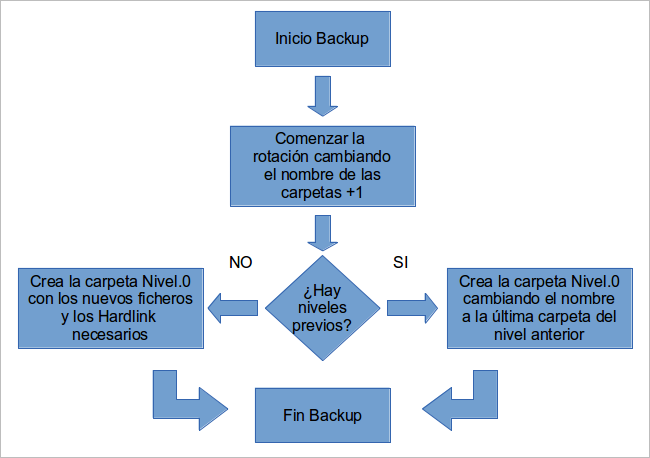

Este es otro punto importante que hay que entender. Por un lado podemos ver el área de configuración de la programación compuesto por 5 fichas:

- Hourly o Durante el día: Copias que se realizarán durante el día en horas distintas.
 1. Primero hará la rotación de las carpetas Hourly, borrando la última y sumando +1 al resto.
 2. Crear y llenar la carpeta Hourly.0: Ficheros nuevos y los hardlink que estime necesarios

- Daily o Diarios: Copias a realizar una vez al día a una hora determinada y los días de la semana que se hayan seleccionado. Hay que tener en cuenta que si en esta política se han activado niveles anteriores aquí no se realizarán copias, sino rotaciones: El último Hourly pasará a ser el Daily.0.
 1. Primero hará la rotación de las carpetas Daily, borrando la última y sumando +1 al resto.
 2. Se utiliza el nivel anterior (Hourly) ?
   - Si: Se crea el Daily.0 renombrando la última carpeta Hourly
   - No: Crea y llena la carpeta Daily.0: Ficheros nuevos y los hardlink que estime necesarios

- Weekly o Semanal: Copia a realizar una vez a la semana en un día y hora determinados. Hay que tener en cuenta que si en esta política se han activado niveles anteriores aquí no se realizarán copias, sino rotaciones: El último Daily pasará a ser el Weekly.0.
 1. Primero hará la rotación de las carpetas Weekly, borrando la última y sumando +1 al resto.
 2. Se utiliza el nivel anterior (Daily) ?
   - Si: Se crea el Weekly.0 renombrando la última carpeta Daily
   - No: Crea y llena la carpeta Weekly.0: Ficheros nuevos y los hardlink que estime necesarios
- Monthly o Mensual: Se repite la lógica descrita en los puntos anteriores
- Yearly o Anual: Se repite la lógica descrita en los puntos anteriores



En más de una ocasión nos hemos referido a ***la última carpeta*** de cada nivel. Eso tiene mucho que ver con la política de retención. Cuando decimos que en un nivel determinado la retención es N, esto significa que las carpetas que se generarán en ese nivel se nombrarán desde 0 a (N-1).

Por ejemplo, si definimos que las copias a realizar durante el día tienen retención de 4,  eso significa que el sistema guardará 4 carpetas: Hourly.0,  Hourly.1,  Hourly.2 y  Hourly.3 .

Cuando llegue el momento de realizar la rotación de las carpetas Hourly hará lo siguiente:

Borra el último Hourly:

```bash
rm -Rf Hourly.4
```


Cambia el nombre al resto para hacer la rotación

```bash
mv Hourly.3 Hourly.4
mv Hourly.2 Hourly.3
mv Hourly.1 Hourly.2
mv Hourly.0 Hourly.1
```


y por último crea un nuevo Hourly.0 con su contenido, copiando los nuevos ficheros y enlazando mediante Hardlinks aquellos que no han sido modificados.

