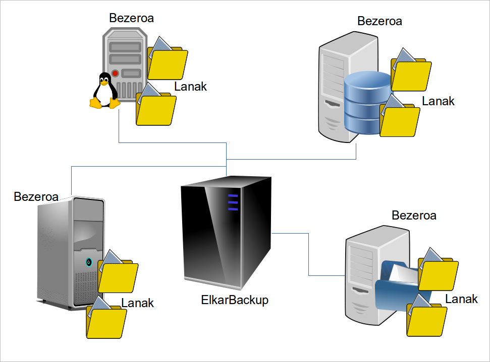

Arkitektura honetan ***bezero*** eta ***lanei*** buruz hitz egingo dugu:

- ***Bezeroa***: GNU/Linux edo Windows makina bat. Makina honetan (gehienetan beste zerbitzari bat izango dena) dauzkagun karpeta ezberdinak kopiatu nahi ditugu.

- ***Lana***: Bezero bakoitzetik kopiatu nahi dugun karpeta bakoitza (erroa). Bezero berdinekoak izan arren, lan bakoitzari politika desberdina esleitzeko aukera izango dugu, bakoitzari bere maiztasuna eta erretentzio politika definituz.

Adibidez, demagun zerbitzari baten alde batetik erabiltzaileen datuak ditugula, eta bestetik zerbitzu jakin batek sortzen dituen log fitxategiak. Denak kopiatu nahi ditugu, baina maiztasun eta erretentzio politikak zeharo desberdinak izango dira kasu batean eta bestean.

Gure zerbitzariak hainbat bezeroetako informazioa jaso eta kopiatu ahal izango du. Bezeroak bete behar duen baldintza bakarra ***rsnyc*** edo ***ssh*** protokoloak erabiltzeko gaitasuna izatea izango da. GNU/Linux zerbitzariekin ez da batere arazorik izango, eta Windows zerbitzarietan  [Cwrsync](https://www.itefix.no/i2/content/cwrsync-free-edition) softwarea instalatuko dugu rsync zerbitzurako (aurrerago azalduko dugu nola konfiguratu behar den).

Komunikaziorako rsync erabiltzeak onura garrantzitsu bat dauka: fitxategien transferentzia hasi aurretik, bien artean fitxategi bakoitza kopiatu beharra dagoen ala ez erabakitzen dute, eta aldaketak bakarrik bidaltzen dira. CPU lan gehien egin beharko duena fitxategiak bidaltzen dituena da eta S/I lan gehien egin beharko duena datuak jasotzen dituena da.
