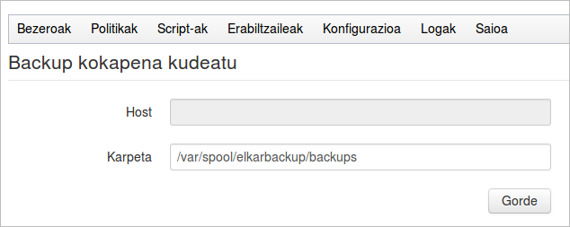

Datuak diskoan kopiatzen ari gara, eta sistemari datuak gordetzeko erabiliko duen karpeta nagusia zein izan behar den esan behar diogu. Ez badiogu besterik esaten, balio lehenetsi moduan ***/var/spool/elkarbackup/backups*** karpeta erabiliko du.

Kopiak egiten hasi ondoren balio hau aldatzen badugu, sistemak ez ditu datu zaharrak ezabatuko, baina restore botoiari klikatu eta datuak berreskuratzera joaten garenean ez ditu aurkituko. Kopiak egiten hasi ondoren datu hau aldatu beharra badugu, zerbitzarira kontsola bidez konektatu eta orain arteko datuak path zaharretik path berrira mugitu beharko genituzke.

Hortaz gain, elkarbackup erabiltzaile eta taldeari karpeta berrian baimenak eman beharko genieke

```bash
root@backups:~# chown -Rf elkarbackup.elkarbackup nuevopath
```

Kontutan izan erabiliko dugun diskoa zerbitzariaren disko fisikoa izateaz gain, sare bidez muntaturiko diskoa ere izan daitekeela, adibidez [ISCSI](http://es.wikipedia.org/wiki/ISCSI) edo [NFS](http://es.wikipedia.org/wiki/Network_File_System) protokoloen bitartez. Hau aukera interesgarria da ElkarBackup zerbitzari birtual moduan jarri nahi dugunean.

Aplikazioak backup kokapena zein izango den zehazteko aukera ematen digu, eta bi konfigurazio mota jarri ditzakegu:

- Disko lokala (Host parametroa hutsik): ElkarBackup aplikazioa instalatuta dagoen Debian zerbitzariarentzat lokala den ***path*** edo ***bide*** bat. Disko fisiko bat izan daiteke, edo aurrez beste teknikak erabiliaz muntatu zaion disko bat (adibidez iscsi bidez).
- NFS zerbitzari bateko diskoan dagoen karpeta konfiguratzeko aukera emango digu (Host parametroan zerbitzariaren izena/IPa jarrita). Hau erabili ahal izateko ElkarBackup instalazioaren Debian zerbitzariak ***autofs*** paketea instalatuta izan behar du (guk hasieran instalatu dugu)



Ez ahaztu kokapena aldatzen badugu Debian sistemaren ***elkarbackup*** erabiltzaileak baimenak izan behar dituela bertan idazteko.
