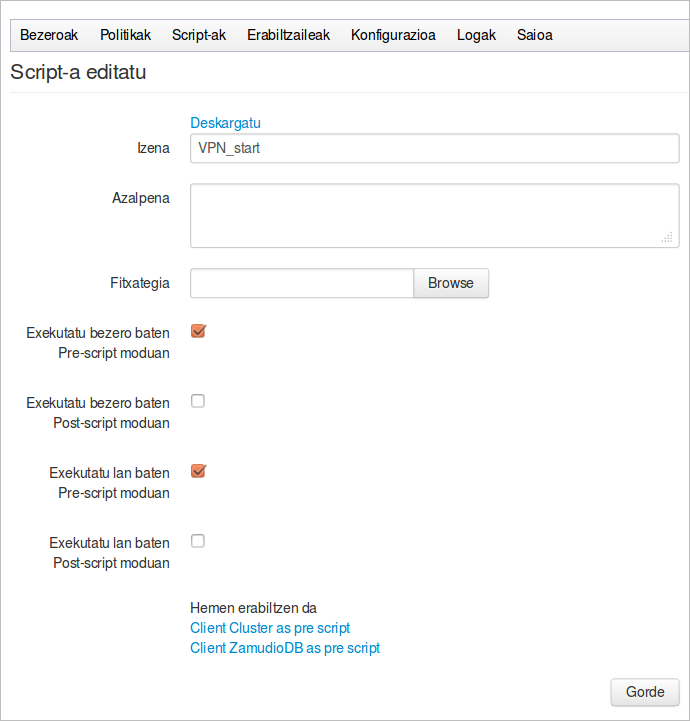

Hauek dira script bat sortzerakoan eskatzen dizkigun datuak:

- Izena eta azalpena

- Fitxategia: gure ordenagailuan programatu dugun scripta igotzeko aukera

- Exekuzio aukerak: Script bakoitzaren logikaren arabera, batzuk ***Bezero mailan*** pentsatuak izango dira, eta beste batzuk ***Lan mailan***. Hauetako batzuk ***Pre-script*** moduan (ekintza abiatu aurretik exekutatu) eta beste batzuk ***Post-script*** moduan (ekintza bukatu ondoren exekutatu). Guk erabakiko dugu nola exekutatu daitezkeen, eta horren arabera lanetan edo/eta bezeroetan hautagarri azalduko dira.

- Ingurune aldagaiak: Scripta berrerabili daitekeenez, idazten dugunean ez dakigu exekuzio garaian zein Bezero/Karpetarentzat exekutatuko den, eta kasu gehienetan informazio hau beharrezkoa izango dugu. Gure script-ean inguruneko aldagai hauek erabili ahal izango ditugu:
 - ElkarBackup_LEVEL: bere balioa JOB edo CLIENT izan daiteke
 - ElkarBackup_EVENT: bere balioa PRE edo POST izan daiteke
 - ElkarBackup_URL: bere balioa lana edo bezeroaren URL osoa da
 - ElkarBackup_ID: lanaren id kodea edo bezeroaren id kodea (zenbakia)
 - ElkarBackup_PATH: snapshot edo kopia erroaren path edo bide osoa
 - ElkarBackup_STATUS: Post-script baten irteera egoera, bestelakorik ezean beti 0 izango da

Aurrez sortutako Script baten informaziora sartzen bagara goian aipaturiko informazioaz gain, script hau non ari garen erabiltzen ikusi ahal izango dugu, deskargatzeko aukera ere emango digu.

Igotzen ditugun script hauek zerbitzariko `/var/spool/ElkarBackup/uploads` karpetan gordetzen dira.

Script baten adibidea jarri dugu ***Errepositorioa konprimitzeko scripta*** atalean.
